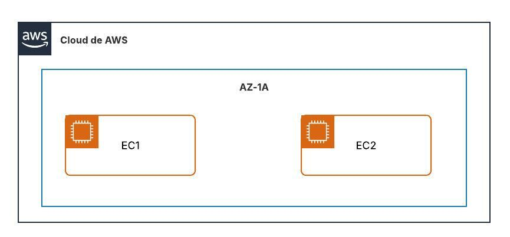

Exercici 1
Crea amb Terraform 2 instàncies EC2 del tipus t3.micro amb Amazon Linux 2023 a la regió us-east-1. Fes també la topologia amb LucidChart. Lliura l’enllaç del repositori GitHub amb l’exercici i el README.md amb l’explicació de l’exercici i la topologia.

Estructura de carpetes a GitHub:
exercicis
pt1-3-ex1
assets
Imatges
README.md
Fitxers Terraform

