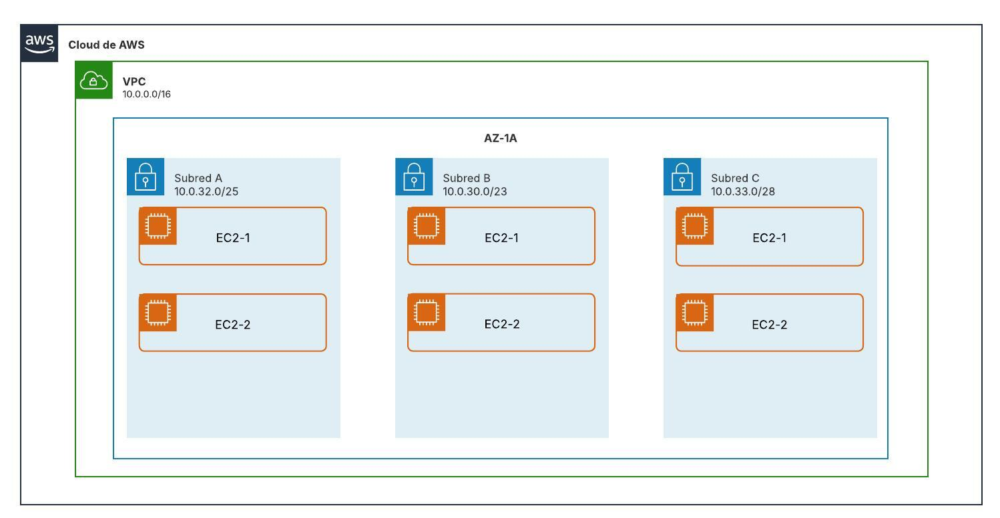

Exercici 2
Crea una VPC amb 3 subnets. La VPC te la següent màscara:

VPC:
Network: 10.0.0.0/16
I les subnets:
SubnetA:
Network: 10.0.32.0/25
SubnetB:
Network: 10.0.30.0/23
SubnetC:
Network: 10.0.33.0/28
Cada subnet ha de tenir 2 instàncies.
Crea amb tant amb la consola d’AWS (interfície gràfica) i després amb Terraform aquesta topologia amb instàncies EC2 del tipus t3.micro amb Amazon Linux 2023 a la regió us-east-1. Totes les subnets han d’estar a la AZ-1A. Fes també la topologia amb LucidChart.

Per consola AWS (interfície gràfica), lliura captura final dels recursos creats.
Per Terraform, lliura l’enllaç del repositori GitHub amb l’exercici i el README.md amb l’explicació de l’exercici i la topologia.

Estructura de carpetes a GitHub:

exercicis
pt1-3-ex1
assets
Imatges
README.md
Fitxers Terraform

